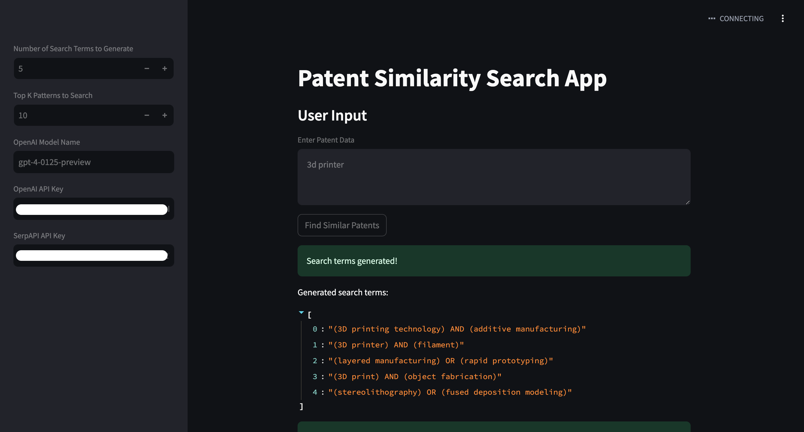
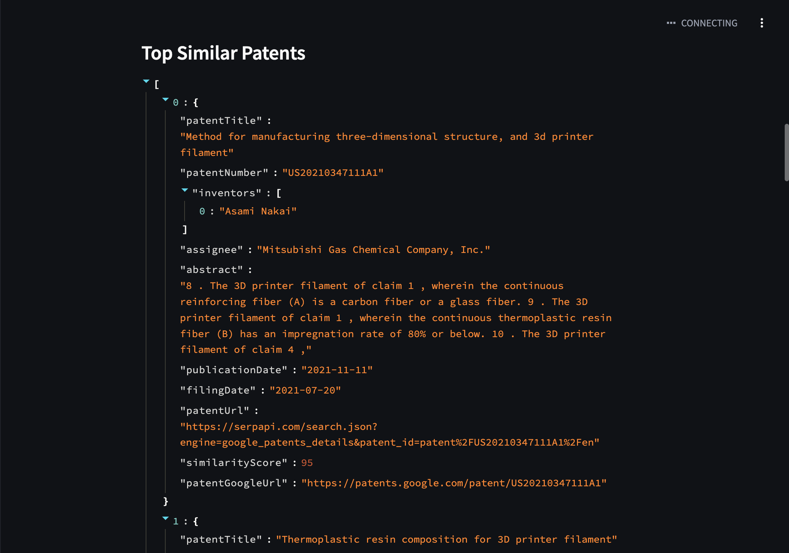

# 🚀 Patent Similarity Search App (LLM + RAG + GOOGLE PATENTS)

## Overview

Meet the **Patent Similarity Search App**, your ultimate AI-powered sidekick for uncovering patents that vibe with your innovations. This app is loaded with cutting-edge tech like **large language models (LLMs)**, **LangChain**, and **ChatGPT**. The app turns the tedious patent search process into a streamlined, high-tech adventure. It's powered by OpenAI's language models and connects to the Google Patent API via SerpAPI, making it feel like you've got a genius with a love for all things nerdy right by your side.

<p align="center">
  
  
</p>

## 🔥 Features

- **Patent Data Input:** Start your search journey by entering patent details into the super-friendly text area on the main page. It’s like finding Easter eggs but for patents!

- **AI-Powered Search Term Generation:** Thanks to OpenAI's ChatGPT, the app crafts razor-sharp search terms from your patent data. It's like giving your keyword optimization a caffeine shot! Each model, from gpt-3.5-turbo to gpt-4, adds its own unique twist to your search journey.

- **Comprehensive Patent Search:** Dive deep into an exhaustive search on Google Patents using SerpAPI. Our app leverages **Retrieval-Augmented Generation (RAG)** to ensure you explore every nook and cranny in your quest for similar patents. With LLMs at the helm, this search is as thorough as a game of Dungeons & Dragons.

- **Similarity Evaluation:** Advanced AI techniques rank patents by their similarity to your input, ensuring the most relevant matches take center stage. Thanks to LangChain's LLM capabilities, you get top-notch accuracy and insights that are sharper than a laser.

## 🛠 Requirements

- Python 3.9+
- Streamlit
- OpenAI API key
- SerpAPI API key
- Langchain

## 🏗 Installation

1. **Clone the repository:**

```bash
git clone https://github.com/your-username/patent-similarity-search-app.git
cd patent-similarity-search-app
```

2. **Install dependencies:**

```bash
pip install -r requirements.txt
```

## 🚀 Usage

1. **Run the app:**

```bash
streamlit run app.py
```

2. **Enter Patent Data:**

   - Enter patent details in the text area on the main page.

3. **Configure Settings in Sidebar:**

   - Specify the number of search terms to generate.
   - Input your OpenAI model name.
   - Enter your OpenAI API key and SerpAPI key.

4. **Find Similar Patents:**

   - Hit the "Find Similar Patents" button and watch the magic unfold.
   - View generated search terms, discovered patents, and similarity scores.

## ⚙️ Configuration

- **OpenAI Model Name:** Default is "gpt-4-0125-preview". Feel free to experiment with the latest models—each one has its own unique personality that can spice up your searches.
- **Number of Search Terms:** The default is 10. More terms mean more potential matches.
- **API Keys:** Don't forget to replace 'YOUR_OPENAI_API_KEY' and 'YOUR_SERPAPI' with your actual keys in the sidebar.

## 🧠 How It Works

- **Search Term Generation:** Utilizing the power of OpenAI’s language models and LangChain, the app generates optimized search terms from your patent data. The LLMs help craft queries that tap into the heart of the RAG system, ensuring efficient and relevant searches. Want creative and out-of-the-box searches? Tweak those prompts and see what happens!

- **Patent Retrieval:** The generated search terms are used to query Google Patents via SerpAPI, pulling in a wide array of potential matches. LangChain's LLMs make data retrieval as effective as assembling a team for an epic quest.

- **Similarity Analysis:** The app uses AI-driven similarity checks on retrieved patents, comparing them to your input patent. Results are sorted by similarity score, with the most relevant patents bubbling to the top, thanks to advanced machine learning algorithms that would make a Vulcan raise an eyebrow.

## 🗂 Project Structure

- **app.py:** Main Streamlit application file.
- **main.py:** Contains core functions for search term generation, patent searching, and similarity checking.

## 🛡️ Error Handling

Our app ensures a smooth experience with error messages for any API hiccups or data processing glitches, handling exceptions like a seasoned pro.

## 🤝 Contributing

1. **Fork the repository**
2. **Create a new branch:**

```bash
git checkout -b feature-branch
```

3. **Make changes and commit:**

```bash
git commit -m "Description of changes"
```

4. **Push changes to GitHub:**

```bash
git push origin feature-branch
```

5. **Submit a pull request**

## 📜 License

This project is licensed under the MIT License.

## 🍀 Licence

This project is licensed under the [GLWT (Good Luck With That)](./LICENCE) License.

## 🙌 Acknowledgments

- **Streamlit:** For the slick web app framework that speeds up deployment and creates user-friendly interfaces.
- **OpenAI:** For the stellar language models that power the AI magic behind our app.
- **SerpAPI:** For the API that turns patent search dreams into reality.
- **LangChain:** For seamlessly integrating language model capabilities to boost the RAG system.
